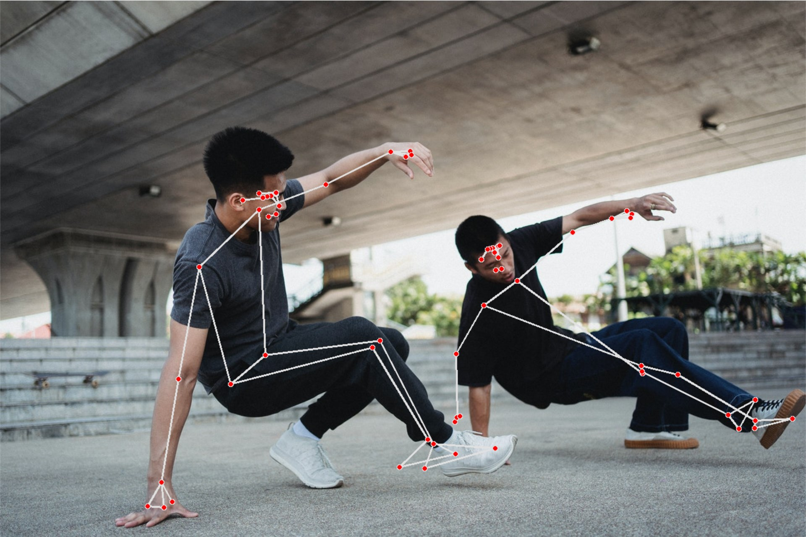
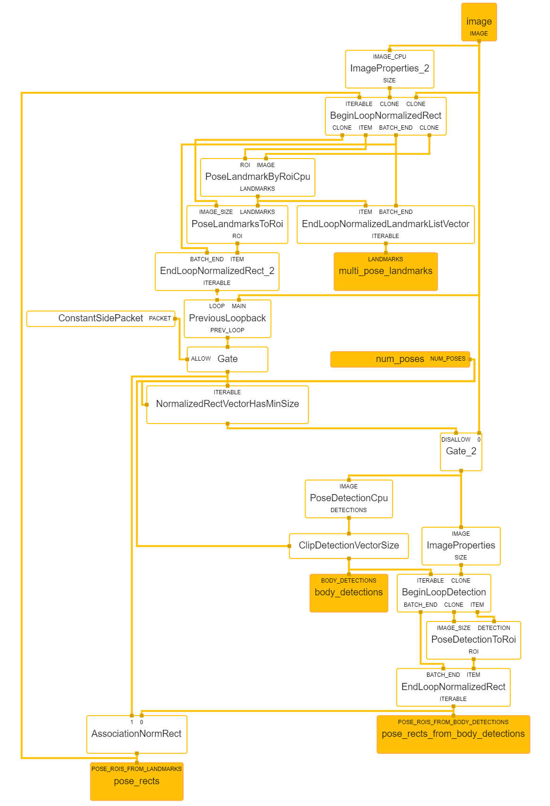

# Multi Pose MediaPipe
[MediaPipe](https://google.github.io/mediapipe/) multi pose detection example. The graph has been adapted from the [HandLandmarkTrackingCpu](https://github.com/google/mediapipe/blob/master/mediapipe/modules/hand_landmark/hand_landmark_tracking_cpu.pbtxt) example by mediapipe. This is only a proof of concept and is provided for educational purposes.


*Source: [Allan Mas](https://www.pexels.com/photo/energetic-asian-men-performing-breakdance-under-elevated-highway-5368956/)*

### Install & Run

Currently, this is only tested on Windows and MacOS. It's recommended to use Python3 (`>3.7`) and a virtual environment.

```bash
python install -r requirements.txt
```

To run an example use the basic python command to start up the script.

```bash
# start pose detection with webcam
python pose.py --static-image-mode

# pose detection with single image
python pose.py --image images/pexels-allan-mas-5368956.jpg
```

There is also a pre-compiled pose detection graph which is not included by default by the mediapipe python distribution package. It is possible to run the example with the following command:

```bash
python detection.py
```

### How to build pbbinary in WSL

```
sudo apt update && sudo apt install bazel-3.7.2
sudo ln -s /usr/bin/bazel-3.7.2 /usr/bin/bazel
```

```
sudo apt install python3-pip
pip install numpy
```

```
sudo apt-get install libegl1-mesa-dev
```

#### Detection

```
bazel build -c opt --copt -DMESA_EGL_NO_X11_HEADERS --copt -DEGL_NO_X11 mediapipe/modules/pose_detection:pose_detection_cpu
```

#### Multi Pose Landmark

```
bazel build -c opt --copt -DMESA_EGL_NO_X11_HEADERS --copt -DEGL_NO_X11 mediapipe/modules/pose_landmark:multi_pose_landmark_cpu
```

### Problems and Bugs

#### Landmark Smoothing
At the moment the landmark filter is not implemented into the graph.

#### Inverse Mat Bug
Only if `static-image-mode` is not enabled.
If head is not detected properly, graph breaks with the following exception:

```python
INFO: Created TensorFlow Lite XNNPACK delegate for CPU.
WARNING: Logging before InitGoogleLogging() is written to STDERR
E20210830 18:36:36.496217 24428 calculator_graph.cc:804] INTERNAL: CalculatorGraph::Run() failed in Run: 
Calculator::Process() for node "poselandmarkbyroicpu__poselandmarksandsegmentationinverseprojection__InverseMatrixCalculator" failed: ; Inverse matrix cannot be calculated.tors/util/inverse_matrix_calculator.cc:38) 
Traceback (most recent call last):
  File "C:\Users\user\multi-pose-mediapipe\pose.py", line 63, in <module>
    main()
  File "C:\Users\user\multi-pose-mediapipe\pose.py", line 47, in main
    results = pose.process(image)
  File "C:\Users\user\multi-pose-mediapipe\mpx\solution_base.py", line 334, in process
    self._graph.wait_until_idle()
RuntimeError: CalculatorGraph::Run() failed in Run: 
Calculator::Process() for node "poselandmarkbyroicpu__poselandmarksandsegmentationinverseprojection__InverseMatrixCalculator" failed: ; Inverse matrix cannot be calculated.tors/util/inverse_matrix_calculator.cc:38) 
[ WARN:0] global C:\Users\runneradmin\AppData\Local\Temp\pip-req-build-sn_xpupm\opencv\modules\videoio\src\cap_msmf.cpp (438) `anonymous-namespace'::SourceReaderCB::~SourceReaderCB terminating async callback

Process finished with exit code 1
```

### Graph



### About
Based on [mediapipe-osc](https://github.com/cansik/mediapipe-osc/).