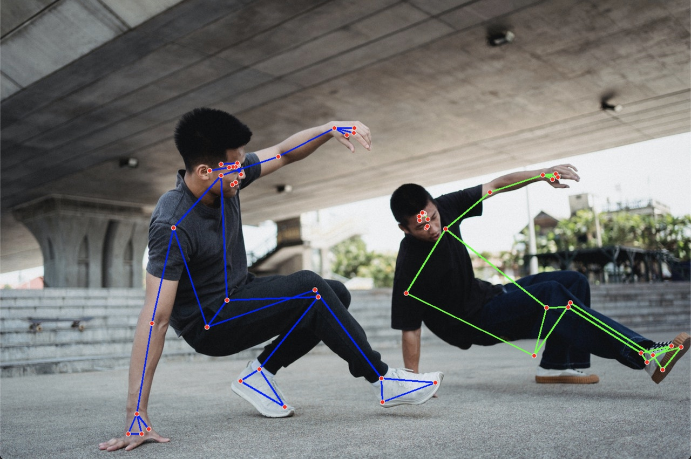

# Multi Pose Landmark MediaPipe
[MediaPipe](https://google.github.io/mediapipe/) multi pose detection example. The graph has been adapted from the [HandLandmarkTrackingCpu](https://github.com/google/mediapipe/blob/master/mediapipe/modules/hand_landmark/hand_landmark_tracking_cpu.pbtxt) example by mediapipe. This is a proof of concept and is provided for educational purposes only.


*Source: [Allan Mas](https://www.pexels.com/photo/energetic-asian-men-performing-breakdance-under-elevated-highway-5368956/)*

### Install & Run

Currently, this is only tested on Windows and macOS. It's recommended to use Python3 (`>=3.7`) and a virtual environment.

```bash
python install -r requirements.txt
```

To run an example use the basic python command to start up the script.

```bash
# start pose detection with webcam
python pose.py

# pose detection with single image
python pose.py --image images/pexels-allan-mas-5368956.jpg
```

There is also a pre-compiled pose detection graph which includes the detection to ROI conversion. It is possible to run the example with the following command:

```bash
python detection.py
```

### Build

To build the graphs, download the [mediapipe](https://github.com/google/mediapipe) repository (`>=0.8.7`) and set the path to this repository as well as to the mediapipe repo in the [build_custom_graphs.sh](build_custom_graphs.sh). After that run the `build_custom_graphs.sh` script and let it compile. If you need help to setup your development environment, have a look at [Building MediaPipe Python Package](https://google.github.io/mediapipe/getting_started/python.html).


### Problems and Challenges

### Pose ROI
The roi, which is detected either by the pose detection or the landmark to pose roi node, is quite large for a person. The overlap of different pose rois leads to difficulties in tracking. This is because the node was made for single pose detection. It is possible to increase the `min-similarity-threshold` parameter to let multiple overlapping pose not be count as one. If another pose detection would be applied, which is way more close to the landmarks detected, this could already solve the problem.

#### MediaPipe Solution
The [solution_base](https://github.com/cansik/multi-pose-mediapipe/blob/main/mpx/solution_base.py#L393-L401) file has been copied into `mpx/solution_base.py` to adapt the path, where the resources are loaded and set the `_input_stream_type_info` manually due to a not registered type error which could not be resolved for now.

#### Landmark Smoothing
At the moment the landmark filter is not implemented into the graph because of difficulties to map filter to pose.

### Graphs

#### Pose Detection with ROI CPU


#### Multi Pose Landmark Tracking CPU


### About
MIT License - Copyright (c) 2022 Florian Bruggisser

Based on [mediapipe-osc](https://github.com/cansik/mediapipe-osc/).
